# Multi-Scale Spatio-Temporal Hypergraph Modeling of Dynamic PPI Networks and Key Driver Protein Identification via Adaptive Gating and Minimum-Energy Control

[](https://doi.org/10.5281/zenodo.18068052)
[](LICENSE)
[](https://www.python.org/)
[](https://pytorch.org/)
[](#citation)

> **Official PyTorch Implementation**
>
> This repository contains the code and data for the paper:
> **"Multi-Scale Spatio-Temporal Hypergraph Modeling of Dynamic PPI Networks and Key Driver Protein Identification via Adaptive Gating and Minimum-Energy Control"**.

---

## Overview

**HyperDriver** is a unified computational framework designed to identify **energy-efficient driver proteins** in **dynamic protein–protein interaction (PPI) networks**. `See Figure 1 for details`

Traditional methods (e.g., Degree Centrality) often conflate structural “hubs” with functional “drivers”. HyperDriver decouples them by combining:

1. **Dynamic Graph Learning**: reconstructing temporal edge weights via a teacher–student (distillation) strategy. `See Figure 2 for details`
2. **Multi-Scale Hypergraphs**: capturing high-order functional synergies beyond pairwise interactions. `See Figure 3 for details`
3. **Minimum-Energy Control**: using a spectral energy proxy and a stochastic greedy search to select drivers. `See Figure 4 for details`

Our results demonstrate that HyperDriver reduces control energy by **≈10^2×** compared to common baselines in multiple yeast datasets.

**Figure 1. Framework figure:**  
---
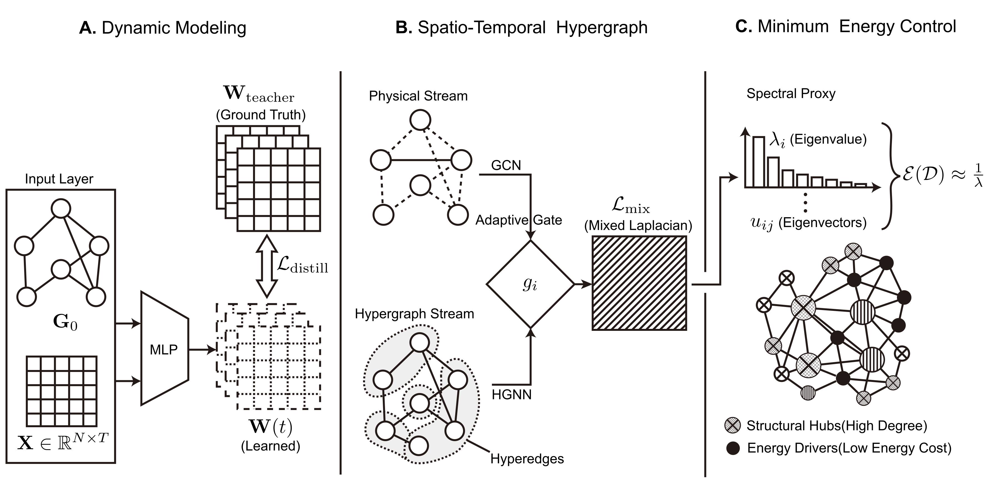

**Figure 2. Dynamic Graph Learning figure:**  
---
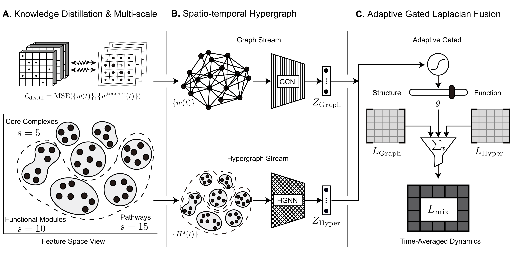

**Figure 3. Multi-Scale Hypergraphs figure:**  
---
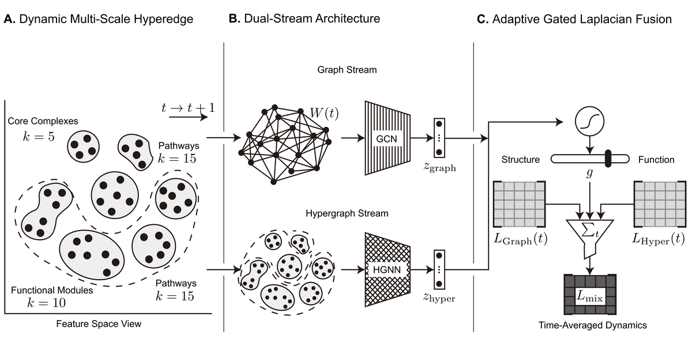

**Figure 4. Minimum-Energy Control figure:**  
---
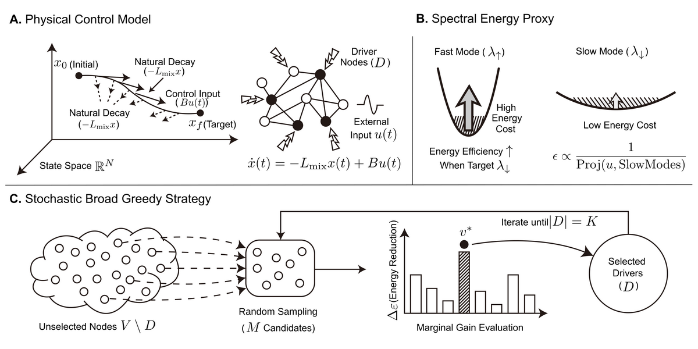

---

## Project Structure

```text
HyperDriver/
├── conf/                         # Configuration files for datasets
├── data/                         # Raw datasets (Static_PPIN, Dynamic_PPIN, Node_Features, etc.)
├── docs/                         # Figures for documentation (e.g., Figure-0.png)
├── resource/                     # Auxiliary scripts for validation & ground-truth preparation
│   ├── driver_case_study/        # Identify representative proteins for case studies
│   │   └── main.py
│   ├── energy_case_study/        # (Physics Exp) Exact Lyapunov energy calculation (dense subnet)
│   │   └── main.py
│   └── node_labels_with_essential/  # (Data Prep) Essential protein label generation
│       └── main.py
├── src/                          # Core source code
│   ├── control_engine.py         # Spectral energy proxy & greedy search (control module)
│   ├── hyper_driver.py           # Model + scoring pipeline
│   └── layers.py                 # Basic neural network / HGNN layers
├── baselines_centrality.py       # Baselines: DC / BC / EC
├── eval_driver.py                # Main evaluation logic (“Efficiency Battle”)
├── plot_nature_figs.py           # Visualization suite for paper figures
├── main.py                        # [MASTER SCRIPT] One-click end-to-end pipeline
└── README.md
```

---

## Prerequisites

- **Python**: 3.12+
- **PyTorch**: 2.5+
- OS: Windows / Linux / macOS (tested on Windows 10 + NVIDIA GeForce RTX 4060 Laptop GPU + 13th Gen Intel(R) Core(TM) i9-13900H 2.60GHz + 16GB MEM)

Core dependencies typically include: `torch`, `torch-geometric` (for GNN parts), `numpy`, `pandas`, `scipy`, `networkx`, `matplotlib`, `seaborn`, `tqdm`.

---

## Installation

### 1) Clone the repository

```bash
git clone https://github.com/lqqhwei/HyperDriver.git
cd HyperDriver
```

### 2) Install dependencies

```bash
pip install -r docs/requirements.txt
```

> If you use CUDA, please install a PyTorch build that matches your CUDA version first.

---

## Reproduction Instructions

We provide a hierarchical workflow to reproduce all experiments reported in the paper, from **data preparation** to **physical verification**.

### Step 1: Data Preparation (Ground Truth)

Before running the main model, generate the **Essential Protein** labels by integrating biological databases (e.g., SGD, OGEE, DEG).

- **Script location:** `resource/node_labels_with_essential/main.py`
- **Command:**

```bash
cd resource/node_labels_with_essential
python main.py
```

- **Output:** generates `output/Node_labels_with_essential.csv`.

---

### Step 2: Main Experiment Pipeline (One-Click)

Run the master script from the repository root to execute the full pipeline:

- **Script location:** `main.py`
- **What it does:**
  1. **Preprocessing**: constructs dynamic graphs for all datasets.
  2. **Training**: trains the HyperDriver model (with distillation if enabled).
  3. **Baselines**: computes Degree / Betweenness / Eigenvector and random baselines.
  4. **Evaluation**: runs the **Efficiency Battle** (e.g., Yu_efficiency_battle.png) and ablation studies (e.g., Yu_ablation_battle.png).

- **Command:**

```bash
# Ensure you are in the root directory (e.g., D:\HyperDriver or ~/HyperDriver)
python main.py
```

- **Outputs:**
  - Results are saved under `results/<dataset>/full/` (CSV scores, metrics, logs).
  - Figures are saved under figures/ `ablation_battles`,`energy_battles`,`global_summary`,`top_drivers`.

---
| Ablation Battle (Yu) Figure | Efficiency Battle (Yu) Figure | Top Drivers (Yu) Figure |
| :---: | :---: | :---: |
| 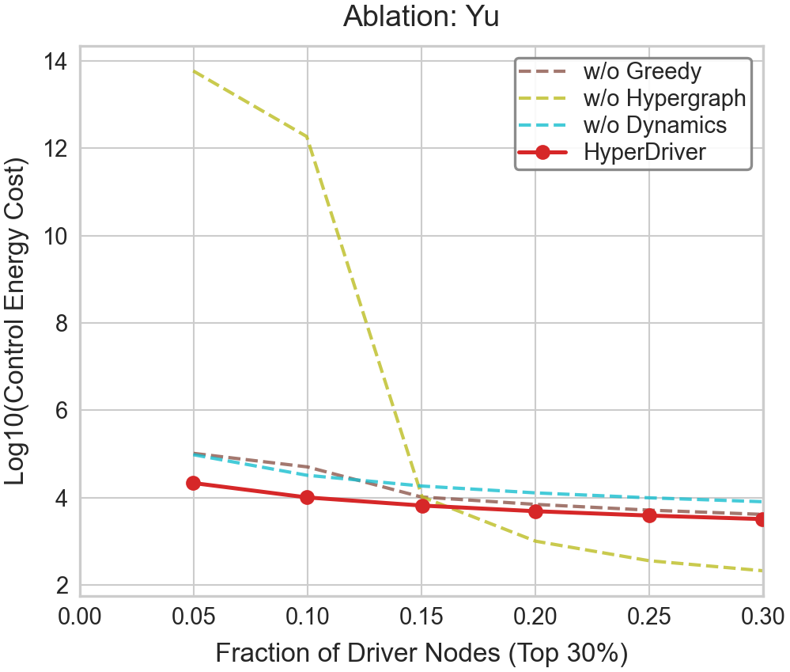 | 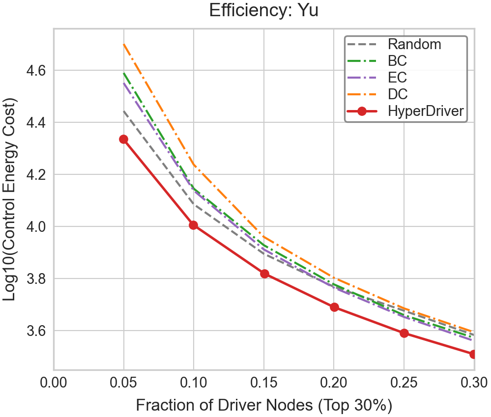 | 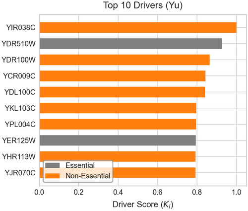 |
| Global Ablation Summary Figure | Global Driver Composition Figure | Global Efficiency Summary Figure |
| 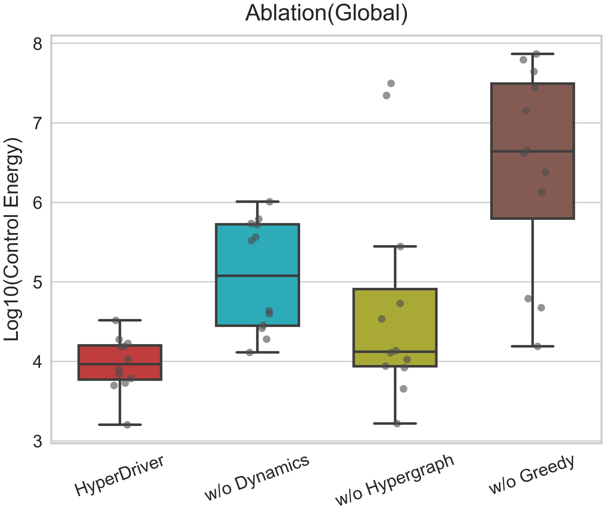 | 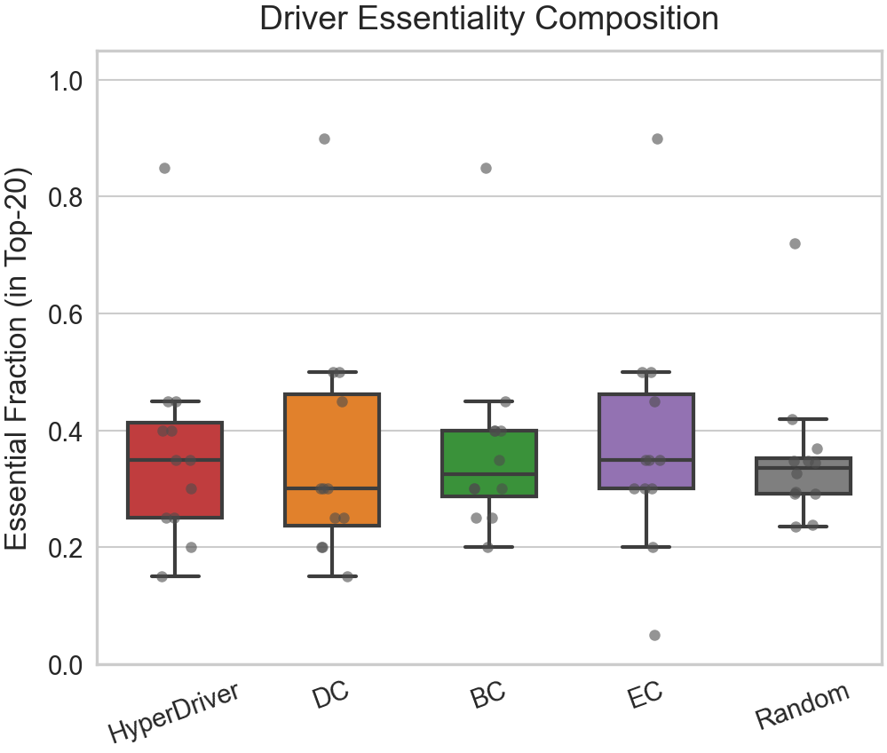 | 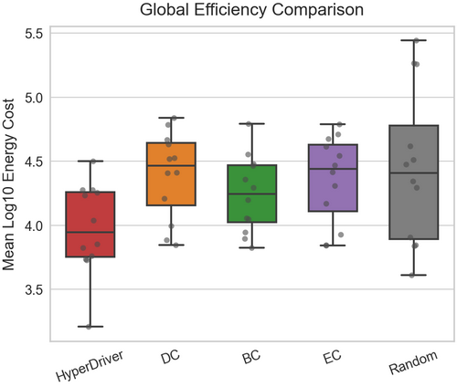 |

- **Image descriptions in the table above:**
  1. **Yu_ablation_battle**: Ablation comparison experiments on the Yu dataset(Line chart).
  2. **Yu_efficiency_battle**: Energy efficiency comparison experiment based on the Yu dataset(Line chart).
  3. **Yu_top_drivers**: The top 10 key driving proteins in the Yu dataset(bar chart).
  4. **global_ablation_summary**: Ablation experiments summarizing 12 datasets(Box plot).
  5. **global_driver_composition**: Key driving protein experiments across 12 datasets(Box plot).
  6. **global_efficiency_summary**: A summary experiment on energy efficiency across 12 datasets(Box plot).
---

### Step 3: Physical Minimum-Energy Verification (Case Study I)

To validate the spectral proxy, we solve the **exact Lyapunov equation** on a dense sub-network (a “ground-truth” physics simulation).

- **Script location:** `resource/energy_case_study/main.py`
- **Command:**

```bash
cd resource/energy_case_study
python main.py
```

- **Output:** generates resource\energy_case_study\output\ `energy_results.csv`, `selection_nodes.png`.
---

| Energy Comparison Case Study Figure |
| :--- |
| 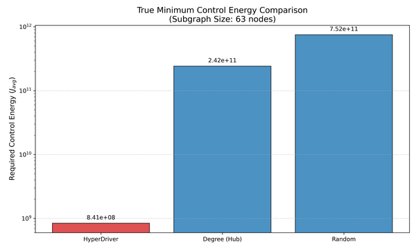 |

- **Image descriptions in the table above:**
  1. **energy_comparison**: Physical minimum energy control experiment based on a 63 nodes protein subgraph from the Yu dataset(bar chart).
---


### Step 4: Key Driver Protein Identification (Case Study II)

To screen for the representative proteins discussed in the paper (e.g., the “Hidden Driver” **YGR192C**), run the candidate selector:

- **Script location:** `resource/driver_case_study/main.py`
- **Command:**

```bash
cd resource/driver_case_study
python main.py
```

- **Output:** generates resource\driver_case_study\output\ `candidates.csv`,`driver_results.csv`.

---
## Datasets

The dynamic yeast DPPIN datasets used in this project are obtained from the original **DPPIN** repository.

- **Source (original release):** https://github.com/DongqiFu/DPPIN
- **Description:** 12 dynamic yeast networks integrating static PPI edges with time-course gene expression.
- **Format:** Raw files (e.g., `Static_PPIN.txt`, `Dynamic_PPIN.txt`, `Node_Features.txt`, `Node_Labels.csv`) are organized under `data/<DatasetName>/`.

> Note: We reorganized the downloaded files into a unified folder structure for reproducible experiments. Please refer to the original DPPIN repository for licensing/usage terms.

---
## Reference (DPPIN)

If you use the DPPIN datasets, please cite the original paper:

```bibtex
@inproceedings{DBLP:conf/bigdataconf/FuH22,
  author    = {Dongqi Fu and
               Jingrui He},
  title     = {{DPPIN:} {A} Biological Repository of Dynamic Protein-Protein Interaction
               Network Data},
  booktitle = {{IEEE} International Conference on Big Data, Big Data 2022, Osaka,
               Japan, December 17-20, 2022},
  pages     = {5269--5277},
  publisher = {{IEEE}},
  year      = {2022},
  url       = {https://doi.org/10.1109/BigData55660.2022.10020904},
  doi       = {10.1109/BigData55660.2022.10020904}
}
```
We thank the authors of DPPIN for making the datasets publicly available.


---
## Results & Outputs

By default, the pipeline organizes outputs as:

- `results/<dataset>/full/`  
  - `*.csv` scores (driver score, energy efficiency, baselines)  
  - logs and intermediate metrics
- `figures/`  
  - paper-ready plots produced by `plot_nature_figs.py`

If your project uses different directories (e.g., `outputs/`), update `conf/` and `main.py` accordingly.

---

## Citation

If you find this code useful, please cite our paper:

```bibtex
@article{HyperDriver2025,
  title   = {Multi-Scale Spatio-Temporal Hypergraph Modeling of Dynamic PPI Networks and Key Driver Protein Identification via Adaptive Gating and Minimum-Energy Control},
  author  = {Qiangqiang Li},
  note    = {Manuscript submitted, under review},
  year    = {2025}
}
```

---

## Contact

For questions, please open a GitHub issue in this repository.

---

## License

This project is licensed under the **MIT License**. See `LICENSE` for details.
